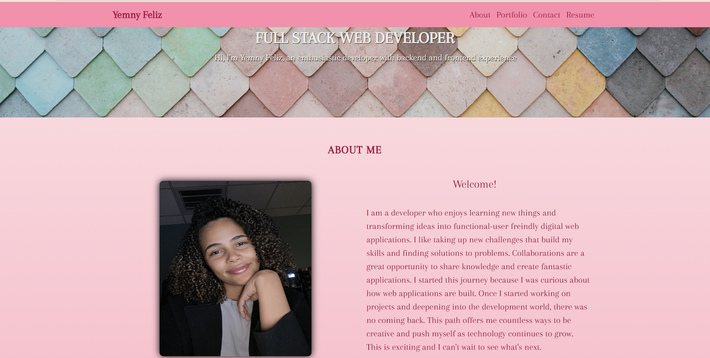

# README Generator

  
  
  
   

  ## Table of Contents
  - [Description](#description)
  - [Installation](#installation)
  - [Usage](#usage)
  - [License](#license)
  - [Contributors](#contributors)
  - [Test](#tests)
  - [Questions](#questions)

  ## Description
  A professional portfolio created with react js and react bootstrap.
  - Navbar: a brandname that directs to homepage and links to about, projects, contact, and resume sections.
  - Homepage: displays a picture of myself and a quick information about me.
  - About: link directs to the homepage.
  - Porfolio: showcases projects that I have worked on with links to the GitHub repositories and deployed websites.
  - Contact: contains a contact me form which requires all fields to be filled in to be submitted and verifies that the email submitted is valid.
  - Resume: Has a link that downloads my resume in pdf form.
  - [My portfolio](https://roaring-tapioca-3aa5ce.netlify.app/)

  ## Installation
 N/A

  ## Usage
A site where other developers and future employees can see my work, my resume, and contact me.
  

  ## License
  This project is licensed under [MIT license](https://opensource.org/licenses/MIT)

  ## Contributors
  Yemny Feliz

  ## Tests
  N/A

  ## Questions
  If you have any questions about this project please contact me:
  - GitHub: [@YemnyFeliz](https://github.com/YemnyFeliz)
  - Email: y.feliz1296@gmail.com
